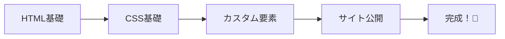

# 🌟 ウェブサイト作りの世界へようこそ！

今日から、あなたもウェブデザイナーの仲間入りです！

## 🎯 この講座で学べること

### できるようになること
- 🏠 自分だけのホームページが作れる
- 🎨 好きな色やデザインにできる
- 📱 スマホでも見られるサイトが作れる
- 🌍 世界中の人に見せられる

### 使えるようになる技術
1. **HTML** - ウェブサイトの骨組み
2. **CSS** - きれいなデザイン
3. **GitHub Pages** - 公開する方法

## 🗺️ 学習の流れ



## 📖 ウェブサイトって何？

### 身近な例
みんなが普段見ているもの：
- 🔍 Google（検索サイト）
- 📺 YouTube（動画サイト）
- 🎮 ゲームの公式サイト
- 🏫 学校のホームページ

これらは全部「ウェブサイト」です！

### ウェブサイトの仕組み
```
あなたのパソコン → インターネット → サーバー
     ↑                                    ↓
     ←────────── ウェブサイトのデータ ──────┘
```

## 🎨 どんなサイトが作れる？

### 作品例
- **自己紹介ページ** - 好きなものを紹介
- **趣味のギャラリー** - 写真や絵を展示
- **日記ブログ** - 毎日の出来事を記録
- **ゲーム攻略サイト** - 好きなゲームの情報
- **ペットの紹介** - かわいい写真がいっぱい

## 🛠️ 使うツール

### 1. CodePen
- ブラウザで使える
- すぐに結果が見える
- 保存も簡単

### 2. GitHub
- 作品を保管する場所
- 無料で公開できる
- プロも使っている

## 💪 プログラミングの心構え

### 大切なこと
1. **間違いを恐れない**
   - エラーは友達！
   - 何度でもやり直せる

2. **まずはやってみる**
   - 完璧じゃなくてOK
   - 少しずつ良くしていく

3. **楽しむこと**
   - 自分の好きなものを作る
   - 友達と見せ合う

### よくある不安と答え

**Q: 難しそう...**
> A: 大丈夫！一歩ずつ進めば必ずできるよ！

**Q: タイピングが遅い...**
> A: ゆっくりでOK！正確に打つことが大切

**Q: 英語がわからない...**
> A: 使う英語は限られているから、すぐ覚えられるよ！

## 📝 覚えておきたい用語

| 用語 | 意味 | 例 |
|------|------|-----|
| タグ | HTMLの命令 | `<h1>`, `<p>` |
| 属性 | タグの詳細設定 | `src`, `href` |
| セレクタ | CSSで指定する部分 | `h1`, `.class` |
| プロパティ | CSSの設定項目 | `color`, `font-size` |

## 🌈 成功のコツ

### やってみよう！
- 🎯 小さな目標から始める
- 🔄 何度も練習する
- 🤝 友達と協力する
- 📚 わからないことは聞く

### 避けたいこと
- ❌ 完璧を求めすぎる
- ❌ 他の人と比べる
- ❌ あきらめる
- ❌ コピペだけで済ます

## 🎊 さあ、始めよう！

準備はできましたか？次は[HTMLの基礎](/docs/tutorial/html-basics)から始めましょう！

:::tip 💡 アドバイス
最初は誰でも初心者。今日から一緒に楽しく学んでいきましょう！
:::

:::note 📝 メモ
わからないことがあったら、いつでも質問してくださいね。
:::